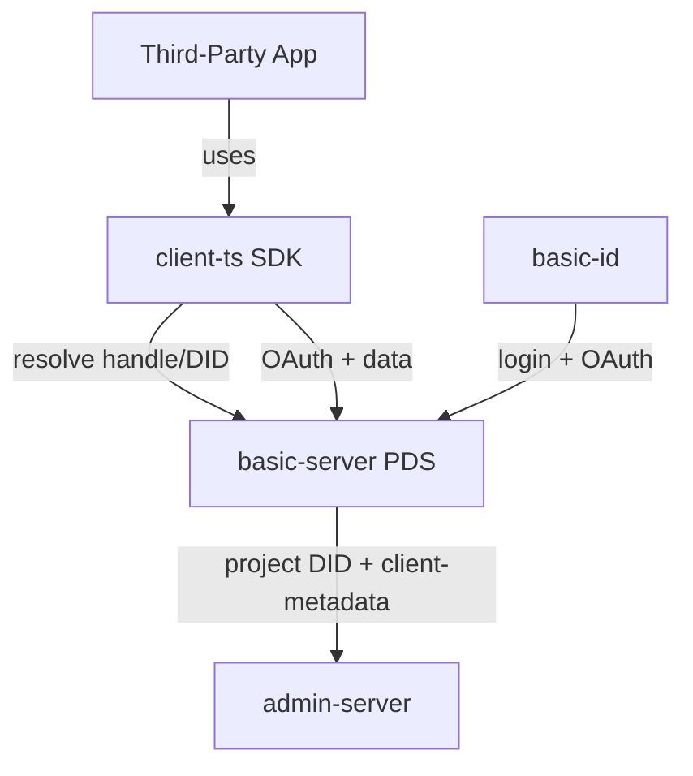
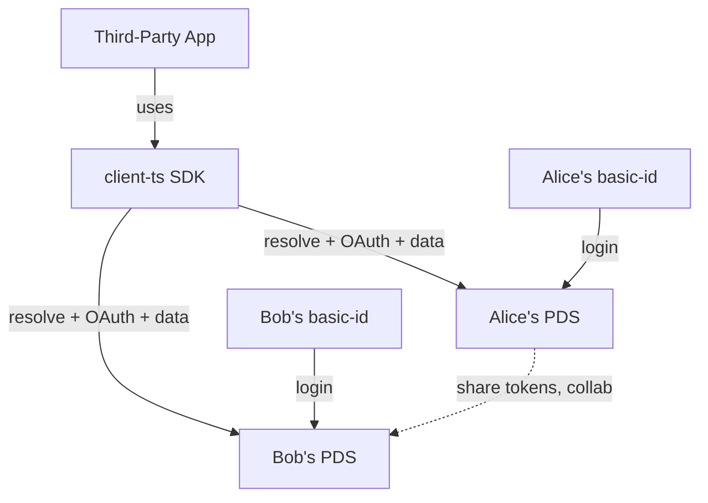

# Basic Protocol - Architecture Overview

## Current Architecture (Post Phase 0–2)

Reflects state after Phase 0 (Foundation Hardening), Phase 1 (Identity & Federation), and Phase 2 (Decouple from Admin-Server). See [ROADMAP.md](./ROADMAP.md) and [VERIFICATION_PHASE0_PHASE2.md](./VERIFICATION_PHASE0_PHASE2.md).

### System Components

```
┌─────────────────────────────────────────────────────────────┐
│                     Third-Party Apps                        │
│                  (using client-ts SDK)                      │
└───────────────────┬─────────────────────────────────────────┘
                    │ resolve handle/DID, OAuth + data
                    ▼
        ┌───────────────────────┐     project DID /
        │   basic-server (PDS)   │◄──── client-metadata (on app resolve)
        │   OAuth Provider       │
        ├───────────────────────┤     ┌───────────────────────┐
        │ • PostgreSQL           │     │   admin-server         │
        │ • DID documents        │     │   App Registry only    │
        │ • Handle resolution    │     │   (project DIDs,       │
        │ • WebSocket Sync       │     │    client-metadata)    │
        │ • Rampart Auth         │     └───────────────────────┘
        └───────────┬─────────────┘
                    │
                    ▼
        ┌───────────────────────┐
        │     basic-id           │
        │   (Auth UI → PDS)      │
        └───────────────────────┘
```

### Current Data Flow

**User Authentication:**

```
App → PDS (OAuth provider), or via basic-id hosted with PDS.
Admin-server is used for app discovery (project DIDs) where applicable; OAuth is with the PDS.
```

**Data Access:**

```
App → client-ts → PDS (OAuth + data). Schema and app metadata from PDS connection meta;
on first app resolution, PDS fetches project DID document and client-metadata (e.g. from admin-server).
```

### Current Components

#### 1. basic-server (PDS Core)

**Location:** `basic-server` (this repo)

**Purpose:** Core Personal Data Store implementation; OAuth provider for user auth and app connections.

**Tech Stack:**

* Fastify 5.6.0
* PostgreSQL (via `postgres` package)
* Node.js 24+ (ES modules)

**Key Features:**

* Dynamic PDS URL from config (`PDS_BASE_URL`); W3C DID documents at `GET /did/:hexId/did.json`; per-user Ed25519 signing keys (Multikey, AT Protocol compatible)
* Handle resolution (`GET /auth/handle/resolve`, `GET /handle/:handle` redirect to DID doc); `GET /auth/check-handle`; handle in DID `alsoKnownAs` and in login/signup/UserInfo
* OAuth2/OIDC provider (PKCE, DPoP, refresh token rotation); full DID in JWT `sub`; standard claims (`iss`, `sub`, `aud`, `typ`); service token verification (EdDSA) for app-to-PDS auth
* Account management and profiles (account-level and per-project); `PATCH /account/handle`
* JSONB-based flexible data storage keyed by `connection_id`; schema from connection meta (no per-request admin-server for schema)
* Real-time WebSocket sync (PostgreSQL LISTEN/NOTIFY)
* Rampart scope-based authorization
* Session management across devices

**Database Schema:**

```
account                 - User accounts (id = bare hex or future did: prefix)
account_signing_key     - Per-user Ed25519 keys for DID documents (AES-256-GCM encrypted)
account_key             - Password hashes (bcrypt; legacy SHA-256 migration on login)
account_connection      - OAuth app connections (project_id = app DID)
account_auth_code       - Authorization codes, tokens
account_auth_session    - Device sessions
account_auth_refresh    - Refresh token chains
account_data            - Application data (JSONB), keyed by connection_id
account_changes         - Change log with revisions, keyed by connection_id
account_profile         - User profiles per project, keyed by connection_id
```

**API Endpoints:**

```
GET  /                                  - Health check
GET  /did/:hexId/did.json               - W3C DID document (dynamic host)
GET  /handle/:handle                    - Redirect to DID document
GET  /auth/handle/resolve?handle=...    - Resolve handle to DID
GET  /auth/check-handle?handle=...      - Check handle availability
POST /auth/signup                       - User registration
POST /auth/login                        - User login (handle or email)
GET  /auth/authorize                    - OAuth authorization
POST /auth/token                        - Token exchange
GET  /.well-known/openid-configuration  - OIDC discovery
GET  /.well-known/jwks.json             - JWKS endpoint
GET  /account/profile                   - Account profile
PATCH /account/profile                  - Update account profile
PATCH /account/handle                   - Update handle (admin scope)
GET  /account/apps                      - Connected apps
GET  /account/sessions                  - Active sessions
GET  /account/:project_id/profile       - Project profile (resolved)
PATCH /account/:project_id/profile      - Update project profile override
DELETE /account/:project_id/profile     - Remove project profile override
WS   /ws                                - WebSocket sync
GET  /:project_id/db/:table             - Query data
POST /:project_id/db/:table            - Insert data
PUT  /:project_id/db/:table/:id        - Update data
DELETE /:project_id/db/:table/:id      - Delete data
```

**Current Issues:**

* App metadata (and thus schema) is still resolved via DID document → client-metadata URL (e.g. admin-server); schema is not yet fully stored and managed locally on PDS
* Redirect URI verification is not yet enabled (DEV-248)

#### 2. basic-id (Frontend)

**Location:** `basic-server/apps/web` (part of the basic-server monorepo)

**Purpose:** Authentication UI and account management

**Key Features:**

* Login/signup UI; supports handles (full or bare) and email
* OAuth consent screens with permission breakdown
* Connected apps management; account settings and profile; handle editable on account page
* Multi-device session management
* Connects to configurable PDS; admin-server may still be used for app listing/discovery where applicable

#### 3. admin-server (App Registry and Project Identity)

**Location:** `admin-server` (separate repo)

**Purpose:** App registry and project identity. Not the OAuth provider for user auth; the PDS is. Admin-server provides project DID documents and client metadata so apps can be resolved by DID.

**Tech Stack:**

* Fastify
* PostgreSQL
* AWS S3 (file uploads)

**Key Features:**

* User management
* Team management (members, roles, invites)
* Project/app registration and management
* Project DID documents: `GET /projects/:hexId/did.json` (Ed25519 Multikey, BasicAppMetadata service endpoint); per-project signing keys (AES-256-GCM) for service tokens
* Client metadata: `GET /projects/:id/client-metadata.json` (returns `client_id` as project DID, redirect_uris, schema)
* API key management; JSON schema versioning; file uploads (icons, backgrounds)

**Note:** May be offered as "Basic Cloud" alongside self-hosted PDS instances; see ROADMAP open questions.

#### 4. client-ts (Client SDKs)

**Location:** `libs/client-ts` (monorepo)

**Purpose:** TypeScript SDKs for building apps; supports DID-based discovery and multi-PDS connectivity.

**Tech Stack:**

* Turborepo monorepo
* TypeScript
* Dexie (IndexedDB)
* WebSocket

**Packages:**

* `@basictech/react` - React SDK
* `@basictech/nextjs` - Next.js SDK
* `@basictech/schema` - Schema validation
* `@basictech/sync` - Sync protocol (internal)

**Key Features:**

1. **Auth** — DID resolver (`resolveDid(did)`, `resolveHandle(handle)`) fetches `/.well-known/did.json` and extracts `#basic_pds` for PDS URL and OAuth endpoints; `normalizeClientId(projectId)` converts bare UUID to app DID; JWT decode with `sub`, `scope`, `typ`; rejects refresh tokens used as access tokens
2. **DB (regular API mode)** — Direct REST API calls to PDS for data
3. **DB (local-first sync mode)** — IndexedDB + WebSocket sync with the PDS

***

## Planned Architecture (ROADMAP Phase 3–4)

Identity and app DIDs are implemented (see [DID_MIGRATION.md](./DID_MIGRATION.md), [ROADMAP.md](./ROADMAP.md) Phase 1–2). What follows is planned for Phase 3 (Sync & Collaboration) and Phase 4 (Features & Production Polish).

### Known Gaps (before or during Phase 3)

* **Redirect URI verification (DEV-248):** Not yet enabled; when enabled, PDS will validate `redirect_uri` against client metadata from connection meta.
* **Schema fully local:** PDS still resolves app metadata (and schema) via DID document → client-metadata URL (e.g. admin-server). Optional future: store and manage schemas locally so PDS does not depend on admin-server for schema.

### Phase 3: Sync & Collaboration

**Goal:** Review and improve the sync system, then build cross-PDS collaboration.

* **Sync review (DEV-113, DEV-114):** Wrap DB writes in transactions; fix WebSocket handler issues (await DB calls, remove `@ts-nocheck`, fix operator precedence and unsubscribe logic); Rampart permissions on WebSocket (per-table/item instead of blanket write); optimize `getChangeCount`; duplicate revision numbers and connection cleanup.
* **Conflict resolution:** Timestamp-based concurrent edit detection; last-write-wins with HTTP 409; conflict resolution UI in basic-id; operation queuing for offline.
* **Cross-PDS share tokens:** OAuth tokens scoped to specific resources; share invitation and acceptance flow; collaborators query owner's PDS directly; real-time WebSocket subscriptions to shared resources.
* **Interop schemas (DEV-140):** Validate reference + project ID + table + fields; API routes for reference tables; sync support for reference tables.
* **Batch update API (DEV-178):** Bulk create/update/delete endpoint; atomic processing; important for sync and offline queue replay.

### Phase 4: Features & Production Polish

**Goal:** Round out the feature set and harden for production.

* **File storage:** S3-compatible backend (AWS S3, MinIO, local FS); file metadata in PostgreSQL; chunked upload/download; content-based deduplication (SHA256); Rampart permissions and signed URLs; SDK methods `db.files.upload()`, `db.files.download()`, `db.files.list()`.
* **Other features:** Phone OTP for OAuth (DEV-215); DB item history & undo (DEV-241); DB table joins (DEV-144); basic-id improvements (verification email, sessions, OAuth signup options).
* **Production hardening:** Rate limiting; monitoring and observability; E2E testing (multi-PDS); deployment templates (Railway, Fly.io, VPS); self-hosting documentation; data export/import for portability.

### Future System (Post Phase 3–4)

```
┌─────────────────────────────────────────────────────────────┐
│                   Third-Party Apps                          │
│                (using client-ts SDK)                        │
└─────────┬───────────────────────────────────────────────────┘
          │ DID resolution (handle / DID document)
          ▼
┌─────────────────────┐         ┌─────────────────────┐
│ Alice's PDS         │         │ Bob's PDS           │
│                     │◄───────►│                     │
│ • PostgreSQL        │  Share  │ • PostgreSQL        │
│ • WebSocket Sync    │  tokens │ • WebSocket Sync    │
│ • File Storage      │  Collab │ • File Storage      │
│ • OAuth Provider    │         │ • OAuth Provider    │
└─────────────────────┘         └─────────────────────┘
```

**Cross-PDS collaboration (Phase 3):** Alice's PDS issues share tokens; Bob's app uses token to query Alice's PDS directly; WebSocket subscriptions for live updates.

**File storage (Phase 4):** App → PDS → file metadata (PostgreSQL) + S3-compatible storage (upload/download, dedup, Rampart).

***

## Component Communication

### Current (Post Phase 0–2)



### Future (Phase 3+ multi-PDS)



***

## Data Models

### Current (Post Phase 0–2)

**User Account:**

* `account.id`: bare hex (did:web) or future `did:` prefix for other methods. Per-user signing key in `account_signing_key` (Ed25519, encrypted).
* External APIs and JWT: full DID (e.g. `did:web:pds.basic.id:did:<hex>`), handle (e.g. `alice.basic.id`), email.

```typescript
// In DB: id (hex), handle, email, profile (JSONB), ...
// In JWT / API: sub = "did:web:pds.basic.id:did:abc123", handle = "alice.basic.id"
```

**App Connection:**

* `account_connection.project_id` is the app DID (e.g. `did:web:api.basic.tech:projects:<hex>`). Data tables (`account_data`, `account_changes`, `account_profile`) use `connection_id` (FK to `account_connection`). Cached client metadata (schema, redirect_uris) in `connection.meta`.

```typescript
{
  account_id: "hex",
  project_id: "did:web:api.basic.tech:projects:abc123",
  scope: "profile read write",
  status: "connected",
  meta: { client_metadata: {...}, fetched_at: "..." }
}
```

### Planned (Phase 3–4)

**Share Token (Phase 3):** OAuth tokens scoped to specific resources; owner DID, collaborator DID, resource path, permissions, expiration. Cross-PDS share tokens and invitation flow are on the roadmap.

**File Metadata (Phase 4):** File metadata in PostgreSQL; S3-compatible storage; path, content_type, size, hash (dedup), storage_key, owner, created_at. See ROADMAP Phase 4.

***

## Security Model

### Current (Post Phase 0–2)

**Authentication:**

* Username/password and handle (full or bare) → PDS; JWT (RS256) with full DID in `sub`; standard claims `iss`, `sub`, `aud`, `typ`; refresh token rotation; `kid: '1'`. Service tokens: EdDSA, `iss` = app DID, verified via DID document and `aud` to prevent cross-PDS replay.

**Authorization:**

* Rampart scopes (hierarchical); OAuth 2.0 with PDS (PDS is the provider); project (app) identified by DID. Redirect URI validation is deferred (DEV-248).

### Planned (Phase 3–4)

* **Phase 3:** Rampart permission checking on WebSocket (per table/item); cross-PDS share tokens (scoped OAuth); owner's PDS validates all operations on shared resources.
* **Phase 4+:** Optional enhancements (cryptographic signatures for audit trails, E2E encryption, zero-knowledge proofs) as in roadmap.

***

## Technology Stack Comparison

| Component         | Current (Post Phase 0–2)                    | Planned (Phase 3–4)           |
| ----------------- | ------------------------------------------- | ----------------------------- |
| **Identity**      | DID:Web (extensible); dynamic PDS URL       | Same; optional DID:PLC        |
| **Discovery**     | Handle resolution + DID documents; handle server | Same                          |
| **Auth**          | PDS is OAuth provider; admin-server is app registry | Same; cross-PDS share tokens  |
| **Data Storage**  | PostgreSQL JSONB; connection_id model       | PostgreSQL + S3-compatible files |
| **Sync**          | WebSocket (single PDS)                      | WebSocket (multi-PDS); Rampart on WS |
| **Collaboration** | Not yet                                    | Direct cross-PDS (Phase 3)    |
| **Files**         | Not yet                                    | S3-compatible storage (Phase 4)|

***

## Migration Path

Phase 0 (Foundation Hardening), Phase 1 (Identity & Federation), and Phase 2 (Decouple from Admin-Server) are complete. The PDS is self-hostable, uses DID:Web identity and handles, acts as the OAuth provider, and identifies apps by DIDs; the client-ts SDK resolves DIDs and discovers PDS and OAuth endpoints. See [VERIFICATION_PHASE0_PHASE2.md](./VERIFICATION_PHASE0_PHASE2.md).

Next:

* **Phase 3 (Sync & Collaboration):** Sync review, WebSocket and Rampart fixes, conflict resolution, cross-PDS share tokens, interop schemas, batch update API. See [ROADMAP.md](./ROADMAP.md).
* **Phase 4 (Features & Production Polish):** File storage, phone OTP, DB history/undo, table joins, basic-id improvements, production hardening. Open questions (admin-server as "Basic Cloud", migration timeline, etc.) are in ROADMAP.

***

## References

* [ROADMAP.md](./ROADMAP.md) - Detailed implementation roadmap (Phase 0–4)
* [DID_MIGRATION.md](./DID_MIGRATION.md) - DID:Web migration design and deployment
* [PHASE2_DESIGN.md](./PHASE2_DESIGN.md) - Phase 2 design (implementation uses App DIDs per ROADMAP)
* [VERIFICATION_PHASE0_PHASE2.md](./VERIFICATION_PHASE0_PHASE2.md) - Phase 0–2 verification report
* [DOCUMENTATION_AUTH.md](../DOCUMENTATION_AUTH.md) - Auth specification
* [ATPROTOCOL_RESEARCH.md](./ATPROTOCOL_RESEARCH.md) - ATProtocol research and comparisons
* [ATProtocol](https://atproto.com/) - Inspiration for federation design

