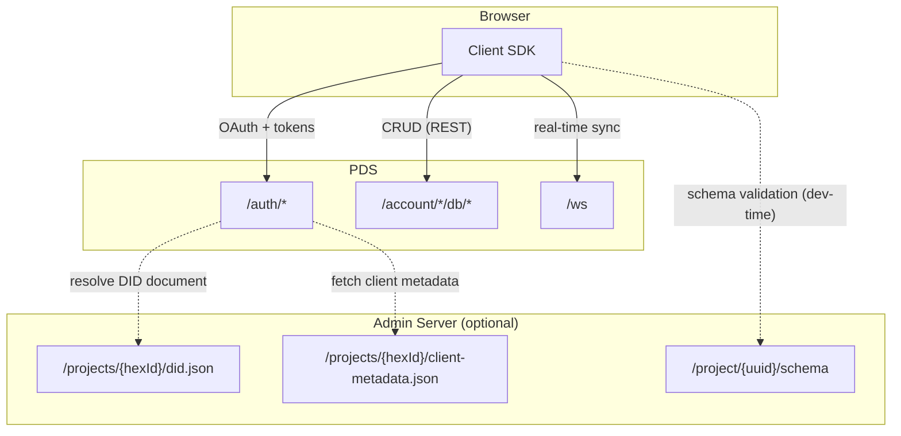

# Federation Architecture & SDK Roadmap

## Overview

Basic is moving toward a federated architecture where apps and users are not tied to a single centralized server. This document describes how the **Client SDK**, **PDS (Personal Data Store)**, and **Admin Server** interact today and how that will evolve.

---

## Architecture: Three Components

### PDS (Personal Data Store)

The PDS is the user's home server. It owns auth, data, and sync for that user.

- **Repo:** `basic-server`
- **Default deployment:** `pds.basic.id`
- **Endpoints the SDK uses:**
  - `POST /auth/authorize` -- start OAuth flow (redirects to consent screen)
  - `POST /auth/token` -- exchange authorization code or refresh token
  - `GET /auth/userinfo` -- fetch user profile
  - `GET|POST|PUT|DELETE /account/{project_id}/db/{table}[/{item}]` -- data CRUD
  - `WSS /ws` -- real-time sync

The PDS identifies apps by their **DID** (e.g. `did:web:api.basic.tech:projects:{hexId}`). During OAuth, the PDS resolves the DID document to discover the app's signing key and metadata endpoint, then fetches the client metadata document. It caches this metadata in `account_connection.meta` so it doesn't need the admin-server on every request.

### Admin Server

The admin server is an optional hosting service for app metadata and schemas.

- **Repo:** `admin-server`
- **Default deployment:** `api.basic.tech`
- **Endpoints relevant to the SDK:**
  - `GET /projects/{hexId}/did.json` -- W3C DID document (public key + metadata endpoint)
  - `GET /projects/{hexId}/client-metadata.json` -- OAuth client metadata document
  - `GET /project/{uuid}/schema` -- published schema for an app

The admin server is **not required** for a PDS to function. Any app can host its own DID document and client metadata. The admin server is a convenience for developers who register apps through `basic.tech`.

### Client SDK (`client-ts`)

The TypeScript SDK (`@basictech/react`, `@basictech/nextjs`) runs in the browser. It handles OAuth sign-in, local-first data with Dexie, REST API fallback, and WebSocket sync.

- **Repo:** `client-ts`
- **Packages:** `@basictech/react` (core), `@basictech/nextjs` (middleware + re-exports)

---

## How They Interact



| SDK action | Destination | What is sent | Notes |
|---|---|---|---|
| OAuth authorize | PDS `/auth/authorize` | `client_id` as DID | PDS resolves DID doc, fetches metadata, redirects to consent |
| Token exchange | PDS `/auth/token` | `client_id` as DID | PDS validates against stored connection |
| User info | PDS `/auth/userinfo` | Bearer token | Token-based, no project ID needed |
| REST CRUD | PDS `/account/{project_id}/db/...` | DID in path, Bearer token | PDS maps to internal `connection_id` |
| WebSocket sync | PDS `/ws` | Bearer token | PDS resolves `connection_id` from token |
| Schema check | Admin `/project/{uuid}/schema` | UUID in path | Dev-time validation only, uses configurable `server_url` |

---

## Key Concepts

### Client ID = App DID

A `client_id` is a `did:web` identifier pointing to the app's DID document:

```
did:web:api.basic.tech:projects:dbebc0b69735abd1a77f72a52aabf970
```

The DID document (served at `https://api.basic.tech/projects/{hexId}/did.json`) contains:
- An Ed25519 public key for verifying service tokens
- A `BasicAppMetadata` service endpoint pointing to the client metadata document

The client metadata document contains:

```json
{
  "client_id": "did:web:api.basic.tech:projects:dbebc0b69735abd1a77f72a52aabf970",
  "client_name": "My App",
  "client_uri": "https://myapp.com",
  "logo_uri": "https://myapp.com/logo.png",
  "redirect_uris": ["https://myapp.com/callback"],
  "grant_types": ["authorization_code", "refresh_token"],
  "response_types": ["code"]
}
```

### Backward Compatibility: `normalizeClientId`

Both the PDS and the SDK include a `normalizeClientId` function that converts bare UUIDs to DIDs:

```
dbebc0b6-9735-4bd1-a77f-72a52aabf970
  -> did:web:api.basic.tech:projects:dbebc0b69735abd1a77f72a52aabf970
```

This maintains backward compatibility for apps that still pass bare UUIDs as `project_id`. The PDS also normalizes on its side, so both old and new SDKs work.

### Connection ID

Inside the PDS, each user-app relationship is tracked by a `connection_id` (UUID foreign key to `account_connection.id`). This is an internal identifier -- the SDK never sees or sends it. The PDS resolves it from the `client_id` in the token.

---

## Current SDK Changes (App DID Migration)

These changes align the SDK with the DID-based app identity system.

### 1. Add `normalizeClientId` utility

New file: `packages/react/src/utils/normalizeClientId.ts`

Converts bare UUIDs to `did:web` format before sending to the PDS. Accepts DIDs as passthrough, so apps that already use DID-based `project_id` values work without changes.

### 2. Normalize `client_id` in OAuth flows

In `AuthContext.tsx`, the `getSignInLink()` and `fetchToken()` functions send `normalizeClientId(project_id)` instead of the raw `project_id`. This sends the canonical DID format to the PDS.

---

## Future SDK Roadmap

These are larger changes deferred until the minimal changes above are stable.

### DID-Based PDS Discovery

Replace hardcoded PDS URLs with automatic discovery:

```mermaid
flowchart LR
    Handle["alice.basic.id"] -->|"resolve handle"| DID["did:web:pds.basic.id:did:abc"]
    DID -->|"fetch DID document"| Doc["DID Document"]
    Doc -->|"read #basic_pds service"| PDS["https://pds.basic.id"]
    PDS -->|".well-known/openid-configuration"| OIDC["OAuth endpoints"]
    OIDC -->|"authorization_endpoint"| OAuth["Start OAuth flow"]
```



- `resolveHandle(handle)` -- HTTP call to resolve a user handle to a DID
- `resolveDid(did)` -- fetch the DID document
- `discoverPds(didDoc)` -- extract PDS endpoint from the `#basic_pds` service entry
- `discoverOAuth(pdsUrl)` -- fetch `.well-known/openid-configuration` for OAuth endpoints

This removes the need for `server_url` and `ws_url` config entirely -- the SDK discovers everything from the user's handle.

### Multi-PDS Connection Support

Currently the SDK connects to a single PDS. In a federated world, different users may be on different PDS instances. The SDK will need to:

- Resolve each user's PDS independently
- Maintain separate OAuth sessions per PDS
- Route data operations to the correct PDS based on the authenticated user

### Self-Hosted App DIDs

The SDK currently assumes app DIDs follow the `did:web:api.basic.tech:projects:{hexId}` pattern. Future versions should:

- Accept any DID as `client_id` directly
- Support self-hosted DID documents for apps not registered on the admin server
- Let developers pass their own DID in the schema or config

### Schema Validation from PDS

Currently schema validation fetches from the admin server (`/project/{uuid}/schema`). The PDS already stores the schema locally in `account_connection.meta`. A future PDS endpoint could serve the schema directly, removing the admin-server dependency for schema validation entirely.

### Remove Hardcoded Default URLs

Once PDS discovery is in place, the hardcoded defaults can be removed:

| Current default | Purpose | Replacement |
|---|---|---|
| `https://api.basic.tech` | `server_url` for OAuth + REST | Discovered from DID document |
| `wss://pds.basic.id/ws` | WebSocket sync | Discovered from DID document |
| `did:web:api.basic.tech:projects:{hexId}` | `normalizeClientId` base DID | Developer provides full DID as `client_id` |

### Service Token Auth (App-to-PDS)

App servers can authenticate directly with a user's PDS using EdDSA-signed JWTs (service tokens). The app signs a JWT with its Ed25519 private key, and the PDS verifies it against the public key in the app's DID document. This enables secure server-to-PDS communication without forwarding client OAuth tokens.

---

## Configuration Reference

### Current SDK config

```tsx
<BasicProvider
  schema={mySchema}          // schema.project_id used as client_id
  project_id="uuid"          // fallback if schema has no project_id
  auth={{
    server_url: 'https://api.basic.tech',   // PDS URL for OAuth + REST
    ws_url: 'wss://pds.basic.id/ws',        // PDS URL for WebSocket
    scopes: 'profile,email,app:admin'
  }}
/>
```

### After App DID migration

Same config interface -- no breaking changes. The `project_id` / `schema.project_id` can be a bare UUID (normalized to DID automatically) or a full `did:web` identifier.

### Future config (with PDS discovery)

```tsx
<BasicProvider
  schema={mySchema}
  client_id="did:web:myserver.com:app"  // self-hosted DID
  auth={{
    // server_url and ws_url are auto-discovered from the user's DID
    scopes: 'profile,email,app:db:read,app:db:write'
  }}
/>
```
